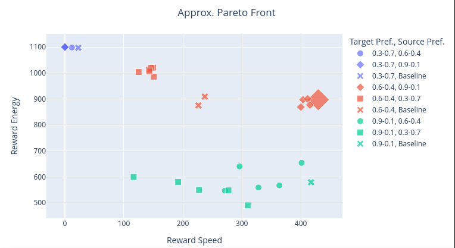
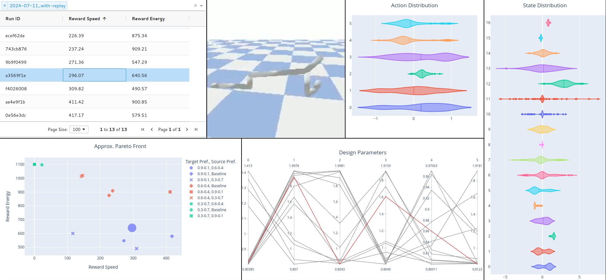

# Multi-Objective Fast Evolution through Actor-Critic Reinforcement Learning

## Acknowledgement of Previous Work

The work is a continuation of the [`Coadaptation`](https://github.com/ksluck/Coadaptation) repository, developed by [Kevin Luck](https://github.com/ksluck), which was extended by [Oskar Rönnberg](https://github.com/psyberprimate) in a forked repository called [`MoCoadaptation`](https://github.com/psyberprimate/MoCoadaptation) during his master thesis. This repository, [`codingWhale13/MoCoadaptation`](https://github.com/codingWhale13/MoCoadaptation), is a fork of a fork.

In short, here's what happened:

1. [`Coadaptation`](https://github.com/ksluck/Coadaptation):
    - Implement the algorithm _Fast Evolution through Actor-Critic Reinforcement Learning_, optimizing both morphology (= design parameters) and behavior (= policy) of an agent.
    - PSO (_Particle Swarm Optimization_) is used to learn the morphology of the agent (e.g. limb lengths)
    - SAC (_Soft Actor Critic_) is used to learn the agent's policy
    - Focus on one environment: PyBullet implementation of HalfCheetah
2. [`psyberprimate/MoCoadaptation`](https://github.com/psyberprimate/MoCoadaptation):
    - Adapt the HalfCheetah environment to a multi-objective (MO) setting, the reward now being a vector of two dimensions: speed and energy conservation
    - Adapt the agent to work with this multi-objective environment by scalarizing the reward based on a weight preference (e.g. 90% speed and 10% energy conservation) and training only on one such preference during one experiment
    - Allow "steering" experiments which load a model trained on a weight preference and then continue learning with a different preference
    - Add plotting utility to visualize the approximate Pareto front and the reward dimensions over time
3. [`codingWhale13/MoCoadaptation`](https://github.com/codingWhale13/MoCoadaptation):
    - Implement additional features:
        - Replay buffer saving/loading
        - Option to condition the policy and Q-network on the weight preference
        - Make option to use scalar/vector Q values easily usable (existed in previous repository, but on different branches)
    - Add two multi-objective environments: Walker2D and Hopper
    - Make code more user-friendly by writing argparse-based scripts for training and plotting
    - Refactor code and remove external dependency of rlkit (see [Code Structure](#code-structure))
    - Add interactive visualization using Plotly Dash (see [MO Dashboard](#mo-dashboard))

### Citation

The original paper [_Data-efficient Co-Adaptation of Morphology and Behaviour with Deep Reinforcement Learning_](https://research.fb.com/publications/data-efficient-co-adaptation-of-morphology-and-behaviour-with-deep-reinforcement-learning/) was presented at CoRL (Conference on Robot Learning) in 2019.

If you use this method in your research, please cite:

```
@inproceedings{luck2019coadapt,
  title={Data-efficient Co-Adaptation of Morphology and Behaviour with Deep Reinforcement Learning},
  author={Luck, Kevin Sebastian and Ben Amor, Heni and Calandra, Roberto},
  booktitle={Conference on Robot Learning},
  year={2019}
}
```

### Acknowledgment From Original Repository

> This project would have been harder to implement without the great work of
> the developers behind rlkit and pybullet.
>
> The reinforcement learning loop makes extensive use of rlkit, a framework developed
> and maintained by Vitchyr Pong. You find this repository [here](https://github.com/vitchyr/rlkit).
> We made slight adaptations to the Soft-Actor-Critic algorithm used in this repository.
>
> Tasks were simulated in [PyBullet](https://pybullet.org/wordpress/), the
> repository can be found [here](https://github.com/bulletphysics/bullet3/tree/master/examples/pybullet).
> Adaptations were made to the files found in pybullet_evo to enable the dynamic adaptation
> of design parameters during the training process."

## Installation

Create a conda environment using [environment.yml](environment.yml). Unlike in the parent repositories, `rlkit` is no longer a dependency.

Some dependency issues might still occur. Here's a list of problems and fixes that might help speed up the process:

-   `AttributeError: 'dict' object has no attribute 'env_specs'`
    -   Solution: downgrade `gym` from 0.26.2 to 0.25.0 (`pip install gym==0.25`, see also [here](https://github.com/bulletphysics/bullet3/issues/4368))
-   `ImportError: libGL.so.1: cannot open shared object file: No such file or directory`
    -   Solution: `pip install opencv-python-headless` (see also [here](https://github.com/ultralytics/ultralytics/issues/1270))

## Major Changes

-   Conditioning on weight preference: Both policy and Q-network of the agent now take the weight preference into account. This itself does not change the (state, action, reward, next state) tuple (reward is a vector here). It only effects the loss calculation which takes the scalarized reward (using the weight preference) into account.
    -   The idea behind this is to allow faster adaptation after loading a checkpoint and steering to a different preference.
-   For more steering control, an agent now has two replay buffers (which appear as one, see [`MixedEvoReplayLocalGlobalStart`](RL/replay_mix.py)). We now have
    1. One replay buffer with the old replay data, loaded from a previous checkpoint and
    2. A fresh replay buffer that will be populated with new experience.
-   The `old_replay_portion` option handles how much percentage of samples are from the old / new replay buffer. At the moment, this is a constant for one experiment, but extending it to follow some schedule should be straightforward.
    -   NOTE: There's currently a problem with this:
        -   While `old_replay_portion=0` works just as expected,
        -   Setting `old_replay_portion=1` leads to never making use of new experiences. This is consistent with the naming, but quite useless. The experiments in the `2024-07-11_with-replay` folder have been created before introducing this option, where we load the entire replay buffer (so "old replay = 1" in the beginning) but then gradually increase the proportion of new experiences. This is due to the size limitation of the replay buffer: New samples get added to the population buffer until full (size: 10M), after that the new samples push out the old ones. The baseline experiments take up 7M samples.
        -   `old_replay_portion=0.7` (the "mix" experiment for which the double-replay-buffer was introduced) works as expected. However, it is questionable how useful this approach is since we heavily overrepresent fresh samples in the beginning (they take up 30% of the samples during training even though most experience is still with the old preference) and underrepresent them (keeping on sampling 70% old experience, no matter how much changed).
        -   Take-away: the size limitation provides a "natural schedule" to rejuvenate the replay buffer over time. With the double replay buffer (and a not-yet implemented schedule), there's more control. However, without the schedule, even replication of the simple "load_replay_buffer: true" setting is not possible.
        -   Quick fix for replicating "load_replay_buffer: true" setting: use the option `which=new` when loading the replay buffer and set `old_replay_portion=0`
-   The replay buffer (meaning only the new [`EvoReplayLocalGlobalStart`](RL/replay_evo.py), populated with new experience) can be saved to disk. Because of its size (~10GB), only the latest replay buffer is stored, separately of the model checkpoints as an individual file.
-   Added a GUI to visualize test results, see [MO Dashboard](#mo-dashboard)

## Experiments

### Effect of Loading Replay Buffer

#### Setup

Three experiments were executed with the aim of showing that loading the replay buffer is helpful when steering from one preference to another. "Steering" means first training one weight preference (e.g. 60% running, 40% energy conservation) and after that opimizing for another preference (e.g. 90% running, 10% energy conservation). The idea is that such steering arrives faster at the desired final result (in this case 90% running, 10% energy conservation), when starting from a non-random baseline.

For simplicity, the following target preferences were used:

-   0.3-0.7 (intended result: crawling motion)
-   0.6-0.4 (intended result: walking motion)
-   0.9-0.1 (intended result: sprinting motion)

For each preference, the following experiments are run:

-   Baseline, training design and policy from scratch (55 design cycles with each preference, saving final replay buffer -> 3 runs)
-   Steering from baseline preference to the other two, loading the baseline checkpoint and then learning another 55 design cycles with the new preference
    -   With replay buffer loading (-> 6 runs)
    -   Without replay buffer loading (-> 6 runs)

This setup was repeated for 3 different settings:

1. 2024-07-11\_**with-replay**: The baseline replay buffer is loaded and this old experience is naturally replaced over time by new samples using the new preference (NOTE: this is not reproducible with the latest state of the code in this repository, see discussion in [Major Changes](#major-changes) above)
2. 2024-07-21\_**without-replay**: Only policy- and Q-network are loaded from checkpoint, but not the replay buffer
3. 2024-07-28\_**partial-replay**: The baseline replay buffer is loaded but only 70% of samples are used during training (while the other 30% are new experience, generated with the new preference)

#### Results

Unfortunately, using the experience from the replay buffer seems to have no effect. For all plots, see the [plots folder](plots). In the image below, the red crosses show that learning the 0.6-0.4 preference (60% running) of HalfCheetah works reliably from scratch. However, when starting from a different preference (red squares is 30% running, red diamonds is 90% running), we see that steering to the desired new preference of 60% running does not work (no matter if/how the old replay buffer is used):

-   Steering from 30% running at least increases speed, compared to the very slow movement of the 30% baseline (see blue cross). However, the baseline is not achieved so it seems like loading the previous policy and Q-network actually hinders achieving the desired behavior.
-   Steering from 90% running does not slow down speed (compared to 90% running baseline, green cross), but interestingly increases energy efficiency. All 90%->60% runs are in a tight cluster, far away from where we want them to be (the red crosses).

It's unclear at the moment what causes this failure in steering from one objective to another and why the replay buffer has seemingly no effect.



### Running New Experiments

Once all required packages are installed (see [Installation](#installation)), new experiments can be created with the code in this repository. It follows some background information on what needs to be done and how the data is stored

#### Training

Run `launch_experiment.py` with the desired parameters to start an experiment. For example, training on the HalfCheetah environment using and a preference of 60% running can look like this:

```bash
python launch_experiment.py --config-id sac_pso_batch_halfcheetah --weight-preference 0.6 0.4 --run-name pref6
```

To see all parameter options, see the [config arguments](#config-arguments) section below or the descriptions in the [base config](/configs/base_config.py).

#### Testing

-   `test_latest.py`: Runs tests on the last model checkpoint for each run -> required for plotting the approximate Pareto front
-   `test_per_iteration.py`: Runs tests for each design iteration of each run -> required for plotting the reward over time

#### Videos

Creating videos from checkpoints can be done with `videos_from_checkpoint.py`. This is also a necessary step for both

-   Showing the policy behavior in the GUI
-   Using `videos_grid.py` to stack videos of different runs and design cycles into one larger video. Example, with 30%, 60%, 90% running from top to bottom:


#### Plotting

Once the test data is created, it can be visualized in two ways:

1. Via the GUI, see [MO Dashboard](#mo-dashboard)
2. Using scripts in `evaluation` folder
    - `plot_approx_pf.py` is similar to the scatter plot in the GUI, but outputs images in PDF format
    - `plot_reward_over_time.py` (Not included in the GUI) shows the reward per design cycle of a steering run overlayed with the the reward per design cycle of the baseline run (ideally, the steered run should converge quicker to the desired reward level than the baseline)

#### Experiment Folder Structure

A single training run is stored in a folder containing these elements:

-   `config.json`
-   `do_checkpoints` folder, containing one CSV file per design cycle:
    1. First row contains two strings: "Design Type", {design type, e.g. "Optimized"}
    2. Second row contains one string and some floats: "Design Parameters", {value}, {value}, ...
    3. Third row contains one string and some floats: {name of first reward dimension, e.g. "Reward Speed"}, {value}, {value}, ...
    4. Fourth row contains one string and some floats: {name of second reward dimension, e.g. "Reward Energy"}, {value}, {value}, ...
    5. ... (more reward dimensions, depending on environment)
-   `rl_checkpoints` folder, containing one PyTorch checkpoint of the trained RL policy per design cycle

These training runs (referred to as `--run-dir` in argparse scripts and `run_folder` in Python code) are contained in a `data_folder` (or `--exp-dir` for "experiment directory") which can have arbitrary subfolder structure. The steering history is automatically recollected, given that all config files and required run folders have not been deleted or moved.

One suggestion for keeping track of multiple runs within one steering experiment is given here:

-   my_experiment (CONTAINS ALL EXPERIMENTS RELEVANT FOR ANALYZING STEERING PERFORMANCE)
    -   0.8-0.2 (TARGET PREFERENCE)
        -   run_direct_{HASH}
        -   run_direct_{HASH} (same setting as folder above, but with different seed)
        -   run_steered_from_0.7-0.3_{HASH}
        -   run_steered_from_1.0-0.0
        -   ...
    -   ...

where the HASH entries are automatically generated unique run IDs and each folder starting with "run" has the following files:

-   `config.json`
-   `do_checkpoints` (contains `.csv` files)
-   `rl_checkpoints` (contains `.chk` files)

## MO Dashboard

To interact with the experimental results, you can use a web-based GUI created with [Plotly Dash](https://dash.plotly.com). It displays a table with all runs and their rewards per objective. The same data is presented visually as an approximate Pareto front (only implemented for 2d case at the moment). Clicking on one of the table entries shows a video of the policy behavior, the distributions of all action and state dimension and highlights the design parameters that were used in the final design cycle. The GUI looks like this:



The GUI requires the following data:

-   Test data in `evaluation/test_data`, needs to contain at least one experiment folder which in turn contains run folders.
-   Videos in `evaluation/assets/videos` with file names `{RUN_ID}_last.mp4` where "last" means this video shows the last design cycle that was trained.

Both test data and videos for the three [experiments](#experiments) can be found [here](https://drive.google.com/drive/folders/1nRF2ejb68xVYoQkMvve0isuXSGi6Xosj?usp=drive_link).

## Code Structure

All relevant code is on the `master` branch; there is no need to switch to any other branch.

Instead of the previous dependency to [`rlkitMO`](https://github.com/psyberprimate/rlkitMO), the relevant code from there is included in the folder [rlkit](/rlkit) of this repository.

### Replay Buffer Structure

The [`MixedEvoReplayLocalGlobalStart`](RL/replay_mix.py) contains two [`EvoReplayLocalGlobalStart`](RL/replay_evo.py) replay buffers (one for old experience if any, one for new experience), which each in turn contain three [`SimpleReplayBuffer`](RL/replay_simple.py), namely:

-   Initial states replay buffer: Used for design optimization
-   Population replay buffer: Used for RL policy optimization
-   Species replay buffer: Used for RL policy optimization, reset after each design cycle

Each such `SimpleReplayBuffer` records tuples containing the following data:

-   Observation
-   Action
-   Reward (in vector format, one value per objective)
-   Next observation
-   Terminal (boolean, True iff environment terminated)
-   Weight preference
    -   NOTE: The population buffer behaves differently than the other two `SimpleReplayBuffer`s when it comes to storing weight preferences. It does not simply store the preference currently trained for but adds some Gaussian noise to each dimension and normalizes (see `get_modified_preference` in `coadapt.py`). The idea here is to make the population buffer more robust to weight preference changes (which can happen later during the "steering" phase) without preventing the training toward the current weight preference (exclusively used in species buffer).

### Previous Code Structure

For the SAC agent, the `Coadaptation` repository uses an implementation from [`rlkit`](https://github.com/rail-berkeley/rlkit). Analogously, `MoCoadaptation` uses [`rlkitMO`](https://github.com/psyberprimate/rlkitMO).

The original `MoCoadaptation` has two branches which coincide with two branches of the dependency `rlkitMO`:

1. `MoCoadaptation/master` introduces the MO setting by using MO environments and scalarizing their vector returns a priori. It goes together with `rlkitMO/coadapt`.
2. `MoCoadaptation/interactive` extends this by vectorizing the Q-function and allowing to load a model from a checkpoint to fine-tune it "interactively". This branch goes together with `rlkitMO/coadapt_interactive`.

To compare this with the code structure in this repository: The functionality from the second scenario is now on the `master` branch, without a direct dependency to `rlkitMO` because the rlkit implementation of SAC is included in this repository.

## Config Arguments

Different experiments are specified by their config files which are in the [configs](/configs/) folder. Compared to the previous config, some things have changed:

**Introduced new arguments:**

-   `config_version`: Did not exist before, now set to 1
-   `run_name`: Human-readable name of the run
-   `timestamp`: Filled automatically
-   `run_id`: Unique random hash, filled automatically (was previously included in file name)
-   `run_folder`: Filled automatically as `f"{data_folder}/run_{timestamp}_{run_name}"`
-   `random_seed`: Random seed used for experiment (was not explicitly stored in the config file before)
-   `verbose`: To specify more verbose console output
-   `use_wandb`: To specify if wandb is used for tracking or not (was not explicit before)
-   `initial_model_dir`: Optional path to model checkpoint that should be loaded before training
-   `save_replay_buffer`: Saving the replay buffer allows loading it from a checkpoint later on
-   `video`/\*: More control for video recording
-   `condition_on_preference`: Give option to condition the policy and Q networks on the weight preference
-   `use_vector_q`: Give explicit option to use scalar or vectorized Q function (one value per objective) during training
-   `old_replay_portion`: Value between 0 and 1, specifying how much experience should be sampled from a previously loaded replay buffer
-   `previous_weight_preferences`: Filled automatically as list of previously trained weight preferences (if any), each entry having format [weight_preference, run id]

**Changed arguments for more clarity:**

-   `name` is now `config_id`, highlighting the idea that this is an identifier which comes with certain unchangeable parameters
-   `data_folder_experiment` is now `run_folder` (see above)
-   Instead of specifying all considered preferences in `weights` and then choosing the desired index with `weight_index`, there now only is `weight_preference` which directly specifies the desired weight preference as a tuple

**Removed unused arguments:**

-   `use_cpu_for_rollout`
-   `nmbr_random_designs`
-   `iterations_random`
-   `load_model`: Can be deducted from `initial_model_dir` being None or specified
-   `exploration_strategy`: String declaring which design exploration strategy to use. Was an unused argument in `_training_loop`. Only the (uniform) random exploration strategy is used.
-   `rl_algorithm_config`/\*/`reward_scale`: Was always set to 1, removed to avoid confusion with energy reward scaling which was introduced in MORL setting.
